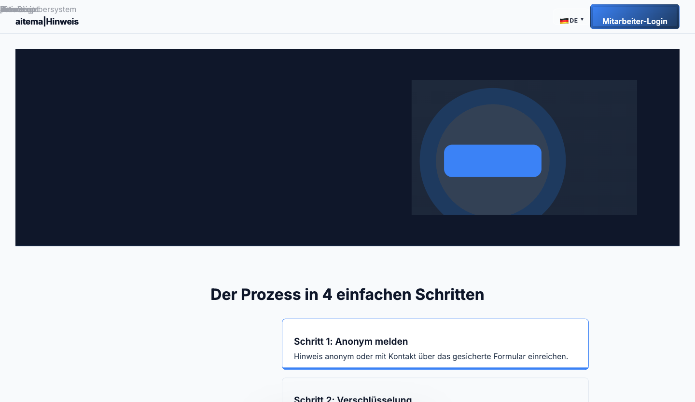

# aitema|Hinweis

> HinSchG-konformes, anonymes Hinweisgebersystem für Behörden und öffentliche Stellen.

[](https://hinweis.aitema.de)
[](https://hinweis.aitema.de)
[](https://hinweis.aitema.de)
[](https://hinweis.aitema.de)

## Screenshots

| Meldeformular | Status-Tracking | Staff-Dashboard |
|:-:|:-:|:-:|
|  |  |  |

## Features

### Für Hinweisgebende (Bürger/Beschäftigte)
- **Vollständige Anonymität** – Kein Account, keine E-Mail erforderlich
- **Verschlüsselter Nachrichtenkanal** – Anonym mit Sachbearbeiter kommunizieren
- **Belegnummer-System** – Meldung jederzeit anonym nachverfolgen
- **Datei-Upload** – Beweisdokumente anhängen (EXIF/Metadaten werden automatisch entfernt)
- **Mehrsprachigkeit** – DE, EN, TR, AR, RU (RTL-Support)

### Für Ombudspersonen und Sachbearbeiter
- **Case-Management** – Vollständige Fallverwaltung (Öffnen → Bearbeiten → Abschließen)
- **Fristenmanagement** – HinSchG: 3-Monats-Frist automatisch berechnet
- **Compliance-Reporting** – Charts: Eingaben je Kategorie, Status-Verteilung, Zeitverlauf
- **Keycloak SSO** – Single Sign-On (PKCE S256, 4 Rollen: Admin, Ombudsperson, Fallbearbeiter, Auditor)
- **Metadaten-Strip** – Automatische Bereinigung von PDF/DOCX/Bild-Metadaten

## HinSchG-Compliance

| Anforderung (§ HinSchG) | Status |
|-------------------------|--------|
| Interne Meldestelle für >50 MA | ✅ |
| Anonyme Meldung möglich | ✅ |
| Rückmeldung innerhalb 7 Tage | ✅ (automatisch) |
| Abschlussmitteilung 3 Monate | ✅ (Fristkalender) |
| Vertraulichkeit der Identität | ✅ (kryptographisch) |
| Keine Repressalien (Dokumentation) | ✅ |

## Technologie-Stack

```
Frontend:  Angular 17 (Standalone, Signals)
Backend:   Python / Flask + SQLAlchemy
Tasks:     Celery + Redis (async Jobs)
Datenbank: PostgreSQL 16
Auth:      Keycloak OIDC/PKCE (Staff) + anonym (Bürger)
Analytics: Plausible (cookiefrei, DSGVO)
Deploy:    Docker Compose + Traefik
```

## Schnellstart

```bash
git clone https://github.com/Aitema-gmbh/hinweisgebersystem.git
cd hinweisgebersystem

# Backend
cd backend && python -m venv venv && source venv/bin/activate
pip install -r requirements.txt
flask db upgrade && flask run

# Frontend
cd ../frontend && npm install && npm start
```

## Architektur

```
hinweis.aitema.de
├── /          → Angular-App (Bürger-Frontend)
├── /melden    → Anonymes Meldeformular (5-Schritt)
├── /status    → Fallstatus mit Belegnummer prüfen
├── /login     → Keycloak SSO (Staff)
├── /dashboard → Case-Management (Staff, geschützt)
└── /api       → Flask REST API
    ├── /api/v1/cases
    ├── /api/v1/messages
    └── /api/v1/analytics
```

## Datenschutz & Sicherheit

- **Keine IP-Logs** für Bürger-Flows
- **Ende-zu-Ende-Verschlüsselung** der Meldungsinhalte
- **Metadaten-Strip**: Pillow (Bilder), pypdf (PDFs)
- **EXIF-Entfernung** automatisch bei Upload
- **Self-hosted**: Keine Cloud-Abhängigkeiten

## Dokumentation

- [Architektur](docs/ARCHITECTURE.md)
- [PRD Features Batch 1](docs/PRD-features-2026-02.md)
- [PRD Features Batch 2](docs/PRD-features-2026-02-batch2.md)
- [PRD Features Batch 3](docs/PRD-features-2026-02-batch3.md)
- [PRD Features Batch 4](docs/PRD-features-2026-02-batch4.md)

---

*Entwickelt von [aitema GmbH](https://aitema.de) · Fragen: datenschutz@aitema.de*
