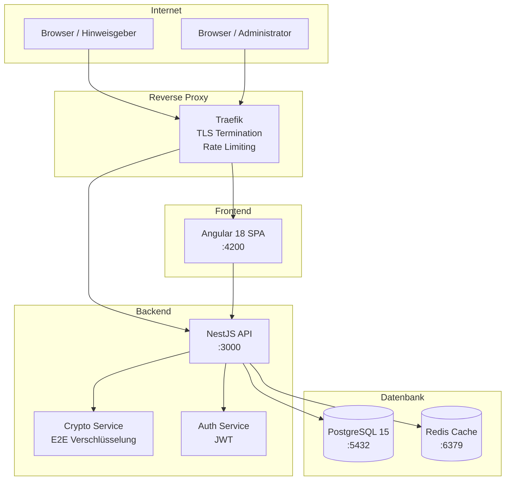
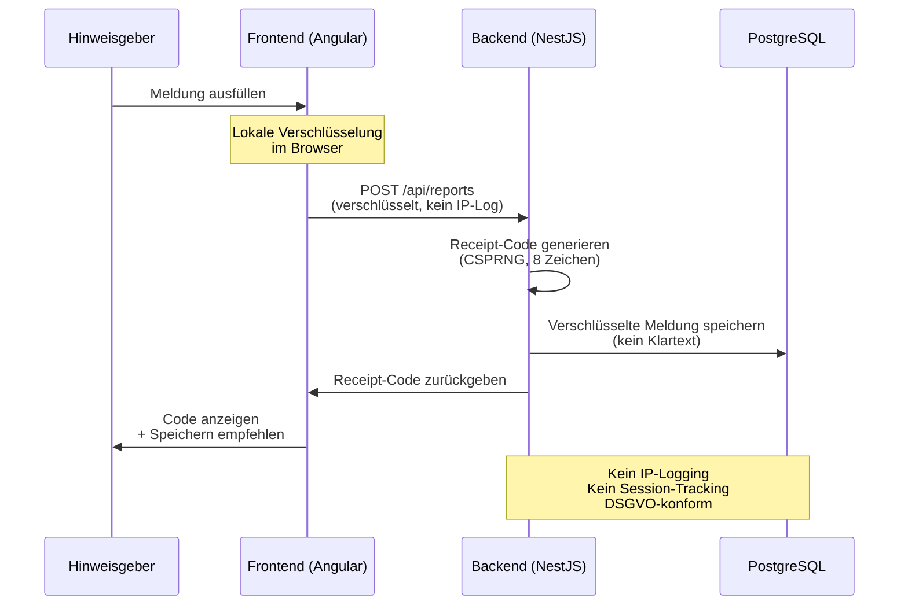
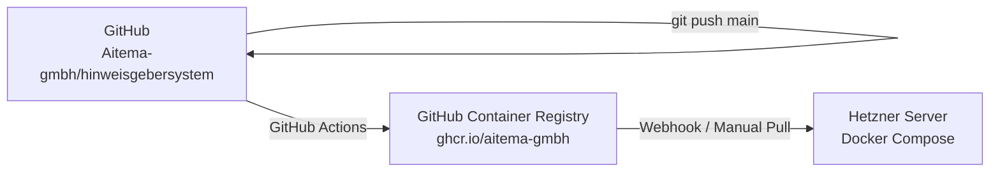

# aitema|Hinweis – Technische Architektur

## Übersicht

aitema|Hinweis ist eine mehrschichtige Webanwendung nach dem Prinzip der strikten Trennung von Frontend, Backend und Datenbank.

## System-Architektur

## Sicherheits-Architektur

## Komponenten

### Frontend (Angular 18)
- **Framework**: Angular 18 mit Standalone Components
- **Styling**: Bootstrap 5 + aitema Design System
- **Internationalisierung**: Eigener I18nService (DE/EN)
- **Barrierefreiheit**: WCAG 2.1 AA, BITV 2.0
- **Build**: ng build → statische Dateien → nginx

### Backend (NestJS)
- **Framework**: NestJS mit Express.js
- **API**: RESTful JSON API mit OpenAPI 3.1 Docs
- **Authentifizierung**: JWT + Refresh Token
- **Verschlüsselung**: libsodium / crypto-js
- **Validierung**: class-validator + class-transformer
- **ORM**: Prisma mit PostgreSQL

### Datenbank
- **PostgreSQL 15**: Hauptdatenbank
- **Prisma ORM**: Type-safe Datenbankzugriff
- **Migrations**: Automatisch via Prisma Migrate

## Deployment

## Technologie-Stack

| Layer | Technologie | Version |
|-------|-------------|---------|
| Frontend | Angular | 18.x |
| Backend | NestJS | 10.x |
| Datenbank | PostgreSQL | 15.x |
| Cache | Redis | 7.x |
| Container | Docker | 24.x |
| Proxy | Traefik | 3.x |
| Sprache | TypeScript | 5.x |
